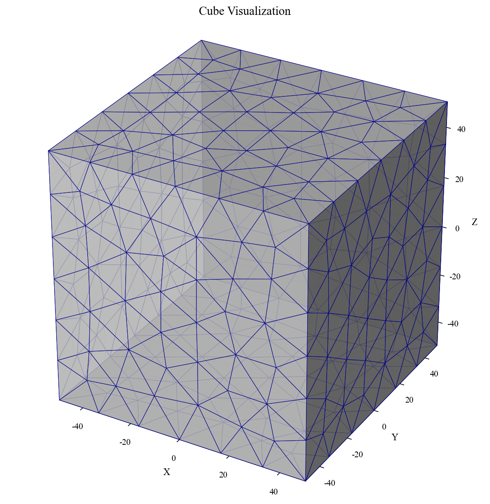
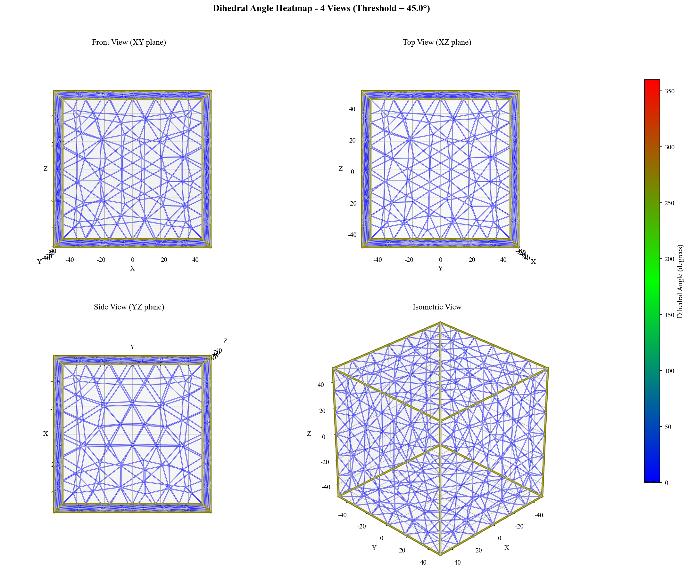
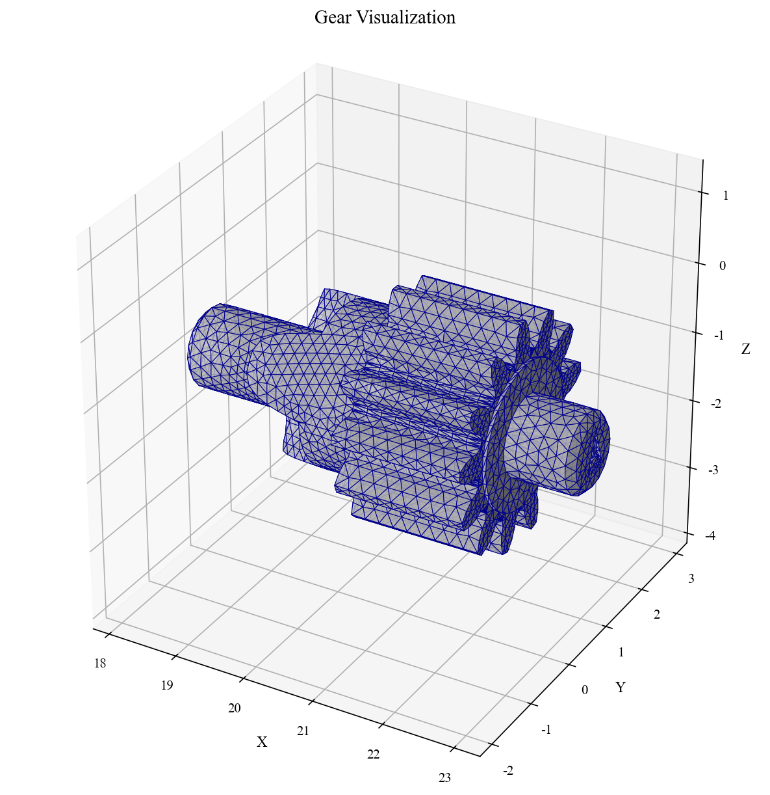
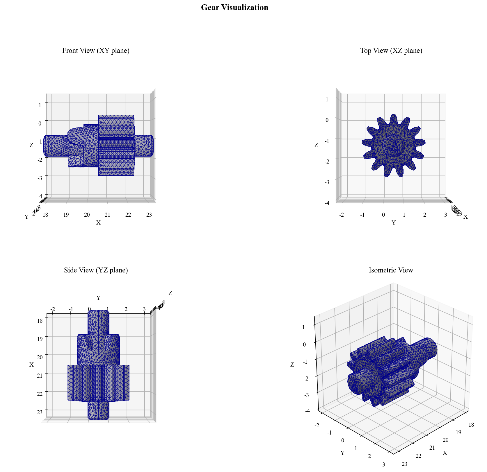
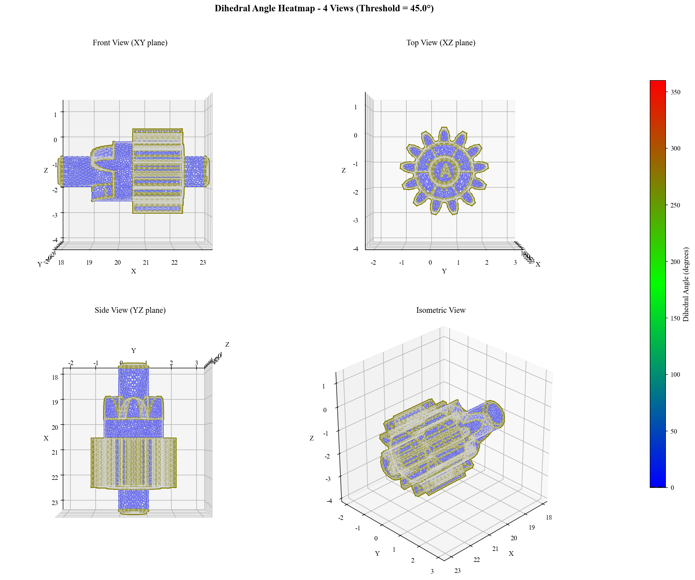

# 3D Mesh Crease Identification (折痕识别)

一个用于检测3D网格模型中尖锐边（折痕）的Python工具，基于二面角阈值进行识别，并对光滑区域进行划分。

## 功能特性

- ✅ **自动加载OBJ格式网格**：支持单个文件或目录批量处理
- ✅ **二面角计算**：计算所有内部边的二面角（单位：度）
- ✅ **尖锐边检测**：基于用户可配置的二面角阈值识别尖锐边
- ✅ **光滑区域划分**：使用广度优先搜索（BFS）算法划分连接的光滑面区域
- ✅ **丰富的可视化输出**：
  - 二面角热力图（3D彩色编码）
  - 二面角热力图四视图（正视图、俯视图、侧视图、等轴测视图）
  - 二面角分布直方图
  - **Region 区域可视化**：每个光滑区域独立生成 PNG 图片，直观展示区域位置
- ✅ **Times New Roman字体**：所有图表使用Times New Roman字体
- ✅ **结构化数据导出**：
  - 尖锐边信息（CSV）
  - 区域划分信息（CSV）
  - 统计信息（JSON）
  - 处理摘要（JSON）

## 安装

### 依赖项
```bash
pip install numpy trimesh matplotlib networkx
```

或使用项目中的 `requirements.txt`：
```bash
pip install -r requirements.txt
```

### 快速开始
```bash
git clone <repository-url>
cd crease_identification
pip install -r requirements.txt
```

## 使用方法

### 基本命令
```bash
python scripts/crease_identification.py --input <OBJ文件或目录> [选项]
```

### 命令行参数
| 参数 | 简写 | 默认值 | 说明 |
|------|------|--------|------|
| `--input` | `-i` | **必需** | 输入OBJ文件或包含OBJ文件的目录 |
| `--threshold` | `-t` | `45.0` | 二面角阈值（度），大于等于此值的边被视为尖锐边 |
| `--output` | `-o` | `output` | 输出数据目录 |
| `--figures` | `-f` | `figures` | 输出图片目录 |

### 示例

1. **处理单个OBJ文件**：
   ```bash
   python scripts/crease_identification.py --input assets/nonsmooth_geometry/Cube.obj --threshold 30.0
   ```

2. **批量处理目录中的所有OBJ文件**：
   ```bash
   python scripts/crease_identification.py --input assets/ --threshold 45.0 --output my_results --figures my_figures
   ```

3. **使用自定义阈值**：
   ```bash
   python scripts/crease_identification.py --input assets/complex_geometry/Gear.obj --threshold 60.0
   ```

### Regions 可视化工具

可视化各个光滑区域的位置，每个区域生成独立的 PNG 图片。

#### 基本命令
```bash
python tools/visualize_regions.py --input <OBJ文件> [选项]
```

#### 命令行参数
| 参数 | 简写 | 默认值 | 说明 |
|------|------|--------|------|
| `--input` | `-i` | **必需** | 输入OBJ文件路径 |
| `--regions` | `-r` | `自动查找` | regions CSV文件路径（可选，默认自动从output/查找） |
| `--output-dir` | `-d` | `output` | 包含处理结果的输出目录 |
| `--figures` | `-f` | `figures` | 图片输出目录 |
| `--mode` | `-m` | `simple` | 可视化模式：`simple`（单视图）或 `4view`（四视图） |
| `--no-edges` | - | `False` | 不显示区域边界边 |

#### 示例

1. **自动生成所有区域的单视图**：
   ```bash
   python tools/visualize_regions.py -i models/Cube.obj
   ```
   自动读取 `output/Cube/Cube_regions.csv`，输出到 `figures/Cube/regions/`

2. **生成四视图**：
   ```bash
   python tools/visualize_regions.py -i models/Gear.obj -m 4view
   ```
   每个区域生成包含正视图、俯视图、侧视图、等轴测视图的图片

3. **不显示边界边**：
   ```bash
   python tools/visualize_regions.py -i models/Cube.obj --no-edges
   ```

## 项目结构
```
crease_identification/
├── assets/                    # 示例OBJ网格文件及处理结果
│   ├── Cube/                  # 立方体示例
│   │   ├── Cube_dihedral_heatmap.png      # 二面角热力图
│   │   ├── Cube_dihedral_heatmap_4view.png # 四视图热力图
│   │   ├── Cube_dihedral_histogram.png    # 二面角分布直方图
│   │   ├── cube.png                       # 简单可视化
│   │   └── cube_4view.png                 # 四视图可视化
│   └── Gear/                  # 齿轮示例
│       ├── Gear_dihedral_heatmap.png
│       ├── Gear_dihedral_heatmap_4view.png
│       ├── Gear_dihedral_histogram.png
│       ├── gear.png
│       └── gear_4view.png
├── packages/                  # 核心算法模块
│   └── preprocessing.py       # 网格预处理、尖锐边检测、区域划分
├── scripts/                   # 应用脚本
│   └── crease_identification.py  # 主程序
├── tools/                     # 工具脚本
│   ├── visualize_obj.py       # OBJ模型可视化工具
│   └── visualize_regions.py   # Regions区域可视化工具
├── output/                    # 数据输出目录（自动生成）
├── figures/                   # 图片输出目录（自动生成）
├── temps/                     # 参考代码（区域划分算法来源）
├── requirements.txt           # Python依赖包列表
├── LICENSE                    # 许可证文件
└── README.md                  # 本文件
```

## 算法原理

### 1. 二面角计算
对于每条边，计算其二面角：
- **内部边**（两个相邻面）：计算两个面法向量之间的夹角，范围为 0°~180°
- **边界边**（一个相邻面）：计算外角，固定为 270°（代表如立方体边缘的90°拐角）
- 计算每个面的法向量（叉积归一化）
- 计算点积并反余弦得到弧度值
- 转换为角度（0°~360°）

### 2. 尖锐边检测
- **内部边**：如果二面角 ≥ 阈值，标记为尖锐边
- **边界边**（只属于一个面的边）：自动标记为尖锐边
- **非流形边**（属于三个或以上面的边）：自动标记为尖锐边

### 3. 光滑区域划分
1. 构建面邻接图，排除尖锐边
2. 使用广度优先搜索（BFS）查找连通分量
3. 每个连通分量构成一个光滑区域

## 输出文件说明

### 1. 数据文件 (`output/<mesh_name>/`)
- `<mesh_name>_sharp_edges.csv`：尖锐边详细信息
  - 列：`vertex1`, `vertex2`, `dihedral_angle_deg`, `is_sharp`
- `<mesh_name>_regions.csv`：区域划分信息
  - 列：`region_id`, `face_index`, `vertex1`, `vertex2`, `vertex3`
- `<mesh_name>_statistics.json`：统计信息
  - 包含顶点数、面数、内部边数、尖锐边数、区域数、二面角统计量等
- `processing_summary.json`：所有网格的处理摘要（根目录）

### 2. 可视化文件 (`figures/<mesh_name>/`)
- `<mesh_name>_dihedral_heatmap.png`：二面角热力图
  - 蓝色→绿色→红色表示角度由小到大（0°~360°）
  - 尖锐边以粗线高亮显示
  - 保持等轴比例，准确呈现几何形状
  - 使用Times New Roman字体
- `<mesh_name>_dihedral_heatmap_4view.png`：二面角热力图四视图
  - 包含正视图、俯视图、侧视图、等轴测视图
  - 统一的颜色条和比例
  - 使用Times New Roman字体
- `<mesh_name>_dihedral_histogram.png`：二面角分布直方图
  - 显示所有内部边的角度分布
  - 红色虚线标记阈值
  - 使用Times New Roman字体

### 3. Regions 可视化文件 (`figures/<mesh_name>/regions/`)
运行 `visualize_regions.py` 后生成：
- `<mesh_name>_region_000.png`：Region 0 的可视化
  - 以浅色线框显示完整模型作为背景参考
  - Region 面片使用 tab20 颜色映射高亮显示
  - 红色粗线标记区域边界边
  - 自动以 region 为中心调整视角范围
- `<mesh_name>_region_001.png`：Region 1 的可视化
- ...（每个 region 对应一个 PNG 文件）

使用 `--mode 4view` 时生成四视图版本：
- `<mesh_name>_region_000_4view.png`：包含正视图、俯视图、侧视图、等轴测视图

## 示例输出

### 示例结果预览

项目 `assets/` 目录中包含了示例模型的处理结果，方便用户直观了解程序运行效果。

### Cube（立方体）示例
立方体包含6个平面，相邻平面之间的二面角为90°，边界边的外角为270°。

**可视化效果**
| 简单可视化 | 四视图展示 |
|:----------:|:----------:|
|  |  |

**折痕识别结果**

| 二面角热力图 | 四视图热力图 | 直方图 |
|:------------:|:------------:|:------:|
| 边界边以橙色270°显示 | 多角度观察 | 角度分布统计 |
|  |  |  |

**处理统计**：顶点24 | 面12 | 内部边18 | 尖锐边12(66.7%) | 光滑区域6

---

### Gear（齿轮）示例
齿轮包含多个齿和过渡曲面，适合测试复杂模型。

**可视化效果**
| 简单可视化 | 四视图展示 |
|:----------:|:----------:|
|  |  |

**折痕识别结果**

| 二面角热力图 | 四视图热力图 | 直方图 |
|:------------:|:------------:|:------:|
| 齿顶齿根红色/橙色折痕 | 多角度观察 | 角度分布统计 |
|  |  |  |

---

### 颜色编码与特点
| 颜色 | 角度 | 含义 | 特点 |
|:----:|:----:|:-----|:-----|
| 🔵蓝 | 0° | 共面 | 粗线(3px)高亮 |
| 🟢绿 | ~180° | 垂直 | 等轴显示 |
| 🟠橙 | 270° | 边界边 | Times字体 |
| 🔴红 | 360° | 最大角度 | 颜色条0°~360°

## 扩展与定制

### 修改阈值
调整 `--threshold` 参数可控制检测灵敏度：
- **较小阈值**（如20°）：检测更多细微特征
- **较大阈值**（如60°）：仅检测明显折痕

### 添加新算法
1. 在 `packages/` 中添加新模块
2. 在 `preprocessing.py` 中集成新函数
3. 在 `crease_identification.py` 中调用

### 支持其他网格格式
项目使用 `trimesh` 库，天然支持多种格式（PLY、STL、OFF等），修改文件扩展名检测即可。

## 许可证

本项目采用 MIT 许可证 - 详见 [LICENSE](LICENSE) 文件。

## 贡献

欢迎提交Issue和Pull Request：
1. Fork 本仓库
2. 创建功能分支 (`git checkout -b feature/awesome-feature`)
3. 提交更改 (`git commit -m 'Add awesome feature'`)
4. 推送到分支 (`git push origin feature/awesome-feature`)
5. 开启 Pull Request

## 致谢

- 使用 [trimesh](https://github.com/mikedh/trimesh) 进行网格处理
- 使用 [Matplotlib](https://matplotlib.org/) 进行可视化

---

**提示**：首次运行时，请确保已安装所有依赖包，并具有对输入文件的读取权限。